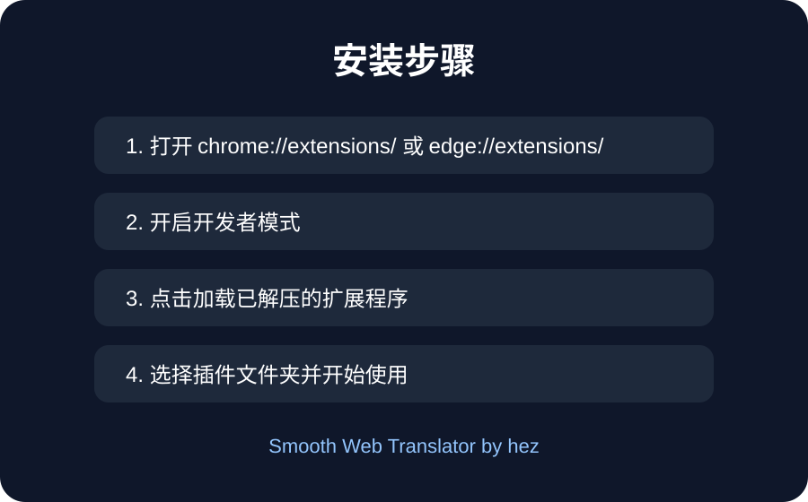
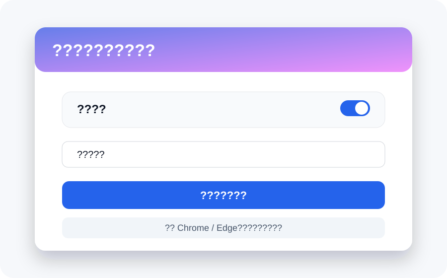
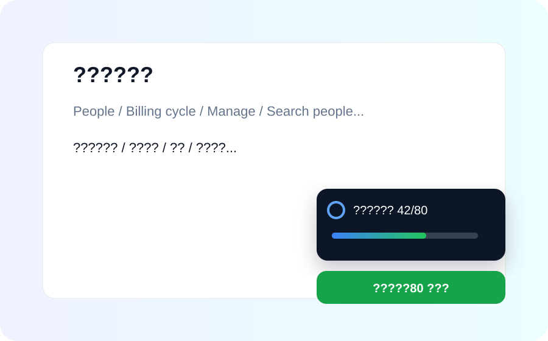

# Smooth Web Translator - 网页实时自动翻译助手

> 作者：hez  
> 说明：这是 hez 使用 GPT-5.5 开发的浏览器网页实时自动翻译插件。

一个适用于 Chrome / Edge 的网页实时自动翻译插件，支持打开页面自动翻译、页面切换自动补翻、滚动加载内容补翻、按钮/菜单/输入框提示翻译，并带有右上角加载动画和翻译进度条。

## 功能特点

- 自动实时翻译当前网页
- 支持页面内部切换后的补翻
- 支持滚动加载内容自动翻译
- 支持按钮、菜单、筛选器、placeholder、title、aria-label 等文字翻译
- 支持右上角翻译成功提示
- 支持加载动画和进度条，方便查看翻译进度
- 低卡顿优化：点击时只处理附近弹窗/菜单，页面整体翻译放到空闲时间处理
- 支持一键还原当前网页原文
- 支持 Chrome / Edge 浏览器

## 安装教程

### Chrome 浏览器

1. 下载本项目源码并解压。
2. 打开 Chrome 浏览器。
3. 地址栏输入：`chrome://extensions/`
4. 打开右上角 **开发者模式**。
5. 点击 **加载已解压的扩展程序**。
6. 选择本项目文件夹。
7. 安装完成后，浏览器右上角会出现插件图标。

### Edge 浏览器

1. 下载本项目源码并解压。
2. 打开 Edge 浏览器。
3. 地址栏输入：`edge://extensions/`
4. 打开 **开发人员模式**。
5. 点击 **加载解压缩的扩展**。
6. 选择本项目文件夹。
7. 安装完成后即可使用。

## 使用教程

1. 打开任意需要翻译的网页。
2. 点击浏览器右上角插件图标。
3. 打开 **自动翻译** 开关。
4. 选择目标语言，例如 **翻译成中文**。
5. 页面会自动开始翻译。
6. 右上角会显示翻译进度，例如：`正在翻译文字 12/80`。
7. 完成后会显示：`翻译完成：80 处文字`。

如果弹出的菜单没有马上翻译，可以把鼠标移到菜单上，或点击一次插件里的 **立即翻译当前页**。

## 支持语言

- 中文
- 英文
- 日文
- 韩文
- 德文
- 法文
- 西班牙文
- 俄文

## 文件说明

```text
manifest.json     插件配置文件
background.js     后台监听页面加载
content.js        页面翻译核心逻辑
popup.html        插件弹窗页面
popup.js          插件弹窗交互逻辑
icons/            插件图标
```

## 隐私说明

插件会读取网页上的文字并调用翻译接口返回译文。插件本身不保存账号密码，不上传浏览器 Cookie，不收集个人资料。

## 开发者

- 作者：hez
- 开发方式：hez 使用 GPT-5.5 开发
- GitHub：https://github.com/2868401/smooth-web-translator

## License

MIT License


## 使用截图

### 插件安装流程



### 插件操作面板



### 翻译进度提示




## GitHub 开源地址

https://github.com/hezwl-1/smooth-web-translator
